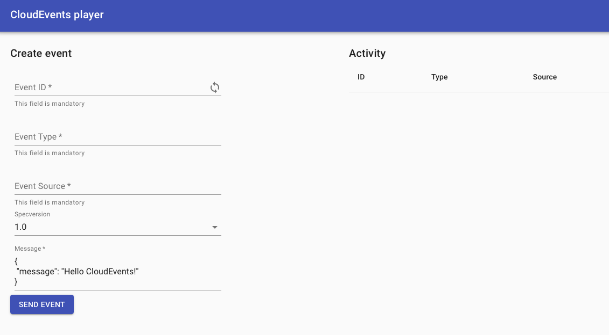
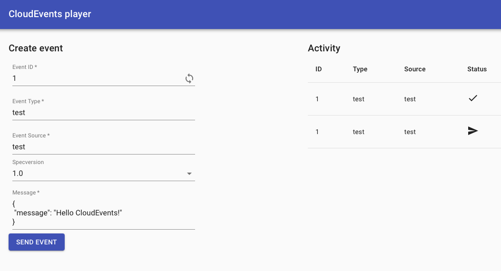

## Your first experience with *Knative Eventing*

### Checking for Existing Resources

Let's first check the current state using the `kn` CLI.

```terminal:execute
command: kn trigger list && kn source list && kn broker list
clear: true
```

Under the hood, these commands are looking for `Trigger`, `Source`, and `Broker` records in Kubernetes. You haven’t done anything yet, so there are none.

### Object Types

- A `Broker` is a component that receives events from a `Source` and distributes them to `Trigger`(s).
- A `Trigger` acts on a specific combination of an event filter paired with an event subscriber.
- A `Source` is a description of something that can create events.

In reality, `Trigger`s don’t really do anything in themselves. They’re objects that get acted on by a `Broker`, with potentially many `Trigger`s per `Broker`.

A `Subscriber` here is anything that *Knative Eventing* knows how to send stuff to.

### Creating a Broker

Let's start with the creation of a `Broker`:

```terminal:execute
command: kn broker create default
clear: true
```

This command creates the default in-memory broker (IMC) that you can use to send events to. In production, you would want to use a broker that is backed by a persistent store.

We can retrieve the broker we just created:

```terminal:execute
command: kn broker describe default
clear: true
```

The URL from the output is the address of the broker itself, we can use it to send or pull events from it.

### Creating a Subscriber and a Trigger

Let's continue with a `Subscriber`. The simplest thing to put here is a basic web app that can receive `CloudEvents` and perhaps help you to inspect those. Below we are creating a Knative Eventing `Service` that will act as a subscriber for our `Broker`.

```terminal:execute
command: kn service create cloudevents-player --image ruromero/cloudevents-player:latest --env BROKER_URL=http://broker-ingress.knative-eventing.svc.cluster.local/{{ session_namespace }}/default
clear: true
```

After the deployment of the `Service` there should be a URL to access the application in the output from the command.

If you open the URL, you should see a form with fields for all the required attributes to send an event to the `Broker`.



To also consume the events from the broker with our application and view them in the blank area on the right, we have to create a `Trigger`.

```terminal:execute
command: kn trigger create cloudevents-player --sink cloudevents-player
clear: true
```

### Sending an Event

If you now head back to your browser and try sending an event, see an example below:



You’ll see that the event is both sent and received.

The simple fact here is that we’ve cheated by making the same application both the `Source` and `Sink` for events.

### Looking Closer

The nomenclature of `sinks` and `sources` is already widespread outside of Knative in lots of contexts. `Sources` are where events come from, `Sinks` are where events go.

You didn’t explicitly define a `Source` and only defined a `Sink` in the `Trigger`. This already hints at how flexible *Knative Eventing* actually is.

Let's have a closer look at our created `Trigger`.

```terminal:execute
command: kn trigger describe cloudevents-player
clear: true
```

As you can see it sets `cloudevents-player` as its `Sink`. Many things can act as a `Sink` without knowing it and they don't have to be Knative Services as you will see at the end of the chapter.

### Cleaning Up

To clean up the environment for the next section run:

```terminal:execute
command: |-
    kn broker delete default
    kn service delete cloudevents-player
    kn trigger delete cloudevents-player
clear: true
```
